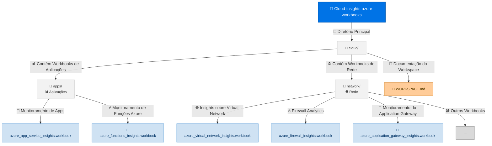

*
<!-- Banner colorido com gradiente -->

  

<h1 align="center" style="color:#1379d2; background: linear-gradient(90deg,#e6f7ff,#b3c6e6); padding: 15px; border-radius: 10px;">
  🚀 Cloud Insights Azure Workbooks
</h1>

  <b>Biblioteca colaborativa de Workbooks personalizáveis para aprimorar a visibilidade, automação e análise de dados em ambientes Azure.</b> 
  <i>Inclui exemplos para redes, aplicações, segurança e muito mais!</i>

---

## 📚 Sobre o projeto

> Este repositório reúne uma coleção de Azure Workbooks otimizados para **observabilidade**, **performance**, **segurança** e **governança** de recursos no Azure.  
> Cada área (redes, apps, dados, segurança, etc.) tem dashboards prontos para uso e customização.

---

## 🗂️ Estrutura do Repositório

## 🛠️ Como Usar

1. **Escolha um workbook** na área desejada (ex: `cloud/apps/azure_app_service_insights.workbook`)
2. Importe o arquivo pelo portal do **Azure Monitor Workbooks** ([Tutorial oficial](https://learn.microsoft.com/pt-br/azure/azure-monitor/visualize/workbooks-overview))
3. Siga as instruções do próprio workbook para customização e filtros dinâmicos

---

## 🎯 Exemplos Rápidos

| Tema          | Workbook                                            | Descrição                       |
|---------------|-----------------------------------------------------|---------------------------------|
| Aplicações    | [App Service Insights](cloud/apps/azure_app_service_insights.workbook)    | Performance e disponibilidade   |
| Funções Azure | [Azure Functions Insights](cloud/apps/azure_functions_insights.workbook)  | Execução e falhas               |
| Rede          | [Network Workbook](cloud/network/)                                  | Tráfego, subnets, NSG           |
| Central Futurista | [Futurist Central](cloud/Workbook_Futurist_Central.workbook)         | Dashboard geral visual           |

---

## 🎓 Tutoriais & Recursos Úteis

- [📖 Guia Oficial Workbooks (Microsoft Docs)](https://learn.microsoft.com/pt-br/azure/azure-monitor/visualize/workbooks-overview)
- [✨ Exemplos prontos de Workbooks](https://github.com/Azure/azure-quickstart-templates/tree/master/demos/workbooks)
- [🎥 Vídeo: Visualizando dados com Workbooks (YouTube)](https://www.youtube.com/watch?v=9k-wTnD7Hq8)
- [🔎 KQL Playground (Query Explorer)](https://learn.microsoft.com/pt-br/azure/data-explorer/kusto/query/)

---

## 🧑‍💻 Contribuindo

1. **Fork** este repositório
2. Crie uma branch: `git checkout -b novo-workbook`
3. Adicione seu arquivo `.workbook` seguindo o padrão de organização e comentários
4. Faça um Pull Request com uma breve descrição

> **Dica:** Sempre comente suas queries KQL e use parâmetros dinâmicos para facilitar o reuso!

---

## 💬 Suporte e Contato

- Use as [Issues](https://github.com/ricardo2009/Cloud-insights-azure-workbooks/issues) para dúvidas, sugestões ou problemas!
- Fale comigo no [LinkedIn](https://www.linkedin.com/in/ricardo2009/) ou abra uma [Discussion](https://github.com/ricardo2009/Cloud-insights-azure-workbooks/discussions)

---

## 🌈 Créditos & Licença

Este projeto está sob a licença **MIT**. Isso significa que você pode usá-lo, modificar e distribuir livremente, desde que mantenha os créditos do autor.  
Consulte o arquivo [`LICENSE`](./LICENSE) para mais detalhes.

  Feito por <b>ricardo2009</b> com 💙 
  

*